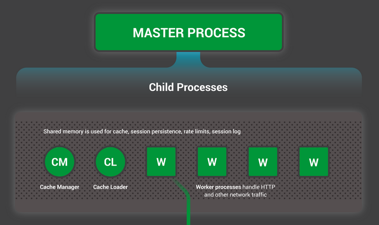
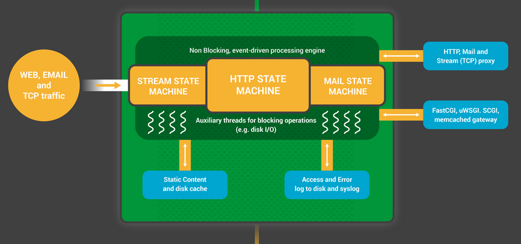
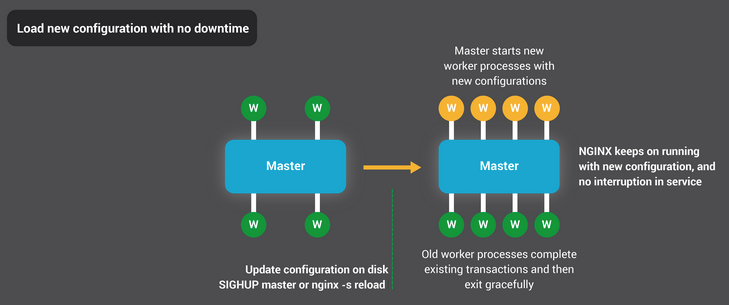
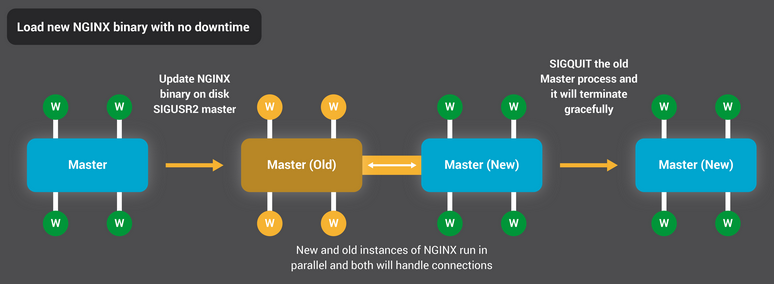
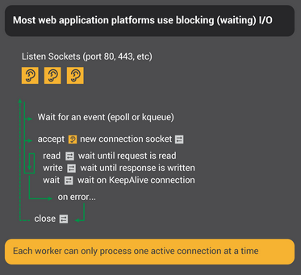
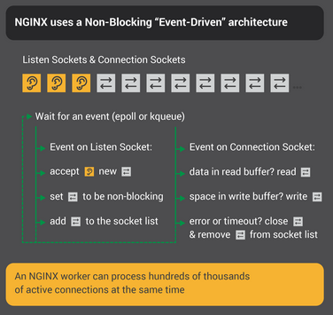

# Phase 0 — NGINX Mental Model

> NGINX is an multi-process, event-driven system that multiplexes thousands of connections over a small number of threads using non-blocking I/O and OS-level readiness notifications (epoll/kqueue).

## Architecture

NGINX uses a master–worker (not master–slave) architecture (see [master-slave-vs-master-worker.md](/master-slave-vs-master-worker.md))



### Master Process (1 process) - orchestrator

##### Responsibilities:

- Reads config
- Spawns worker processes
- Handles signals (reload, restart, log rotate)
- Graceful shutdowns

It does NOT handle requests

### Worker Processes (N processes)



If worker_processes are set to auto:

- Typically 1 worker per CPU core (OS schedules workers to cores randomly)
- 1 thread for request handling (accepting requests)
- thread pools for:
    - Disk I/O
    - Blocking operations
    - Run `aio threads;` in nginx to check

Each worker:

- Handles thousands of connections
- Uses non-blocking I/O
- Uses epoll
- Runs an event loop

#### Why Processes Instead of Threads ?

1. Memory Isolation
    - Processes don’t share memory by default
    - No race conditions
    - No locks needed
    - Simpler + safer
2. Stability
    - If one worker crashes → others keep running
    - Master can restart it
3. Predictable Performance
    - No thread contention
    - No lock overhead
    - More deterministic behavior under load

Note: Workers are not strictly “pinned” to cores, but in practice the OS scheduler distributes them effectively.

### [Controlling NGINX](https://nginx.org/en/docs/control.html)

The master-worker architecture allows NGINX to achieve the Holy Grail of high availability.

#### Updating Configuration



When the master process receives a SIGHUP (or nginx -s reload command), it does two things:

1. Reloads the configuration and forks a new set of worker processes
    - These new worker processes immediately begin accepting connections and processing traffic
2. Signals the old worker processes to gracefully exit
    - stop accepting new connections
    - finish existing requests
    - exit gracefully

#### Upgrading NGINX itself



The binary upgrade process is similar in approach to the graceful reload of configuration

1. New master process starts alongside old one
2. Both share listening sockets
3. Traffic is gradually shifted
4. Old master exits gracefully

# Core Architectural Concepts

## Thread-per-Request vs Event Loop

These are different execution models, each with strengths.

#### Thread-per-Request model



For every incoming request:

1. Create a thread (or take from pool)
2. Thread:
    - Reads request
    - Waits for I/O (disk/network)
    - Processes
    - Writes response

##### Strengths

- Simple mental model
- Excellent for CPU-bound workloads
- Natural parallelism across cores
- Flexible scheduling (shared thread pool)

##### Problems

Assume:

10,000 concurrent users
You now need 10k threads

- Memory:
    - Each thread ≈ 1MB stack
    - 10k threads → ~10GB RAM
- Context switching:
    - CPU constantly switching between threads
    - Cache misses explode
- Most threads are idle:
    - Waiting for I/O (doing nothing)

Example servers:

- Apache HTTP Server
- Apache Tomcat

#### Event loop model



When an async operation is needed, the event loop registers a callback with the OS.

- It DOES NOT WAIT for the operation to finish.
- It moves on to the next task.
- When the operation completes, the OS sends a notification.
- The event loop then executes the callback.

##### Behavior

- 1 thread can handle multiple connections
- Work is interleaved, not serialized per request
- CPU is actually used efficiently

##### Strengths

- Extremely efficient for I/O-bound workloads
    - The loop does not wait for I/O to finish v/s thread model waits for entire lifecycle of the request to finish
- Minimal threads
    - 1 thread for request management
    - Couple of threads ffor Disk, I/O etc.
- Low memory usage
    - No thread stack, shared memory etc.
- No idle waiting
    - CPU is only used when there is work to be done, other work is handled by OS

##### Trade-offs

- CPU-heavy work blocks the event loop
    - If a request is CPU intensive, it will block the event loop and hence all other subsequent requests
- Work inside a worker is sequential
    - Generallly a request is processed in parts - Parse headers, rate limits, etc. and all this work is interleaved between requests
- Load balancing across workers is coarse-grained
    - It is possible that a worker keeps accepting connections and all it's connections are CPU heavy, so the latency for that worker will increase.
    - No easy way to rebalance workload across workers because the connection is tied to a worker for its entire lifecycle.

##### Key Insight: Concurrency vs Parallelism

- Non-blocking I/O gives concurrency
    - Hence, event loop model is much better for I/O bound workloads
- Multiple workers give parallelism

## Blocking v/s Non-Blocking

#### Blocking I/O (Wait until data arrives)

Example code:

```node
data = read(socket);
```

If no data is available: Thread is stuck

It cannot:

- Serve other users
- Do anything else

#### Non-Blocking I/O (Check if data is ready. If not, move on)

```node
data = read(socket);
```

If no data: Returns immediately (e.g., EAGAIN)

Now your program can:

- Try another connection
- Do useful work

##### Polling with non-blocking

If you keep checking manually:

```node
while(true) {
for socket in sockets:
try read(socket)
}
```

- Wastes CPU

To solve this we use OS Readiness notifications - epoll / kqueue

> ## FAQ
>
> Is Thread-per-Request and Event loop a different thing than Block and Non-Blocking. It feels they go hand in hand. Can you have one without the other ?
>
> Threading model and blocking model are independent—but some combinations are useless or broken.
>
> | Model                             | Threads | Blocking | Scalability  |
> | --------------------------------- | ------- | -------- | ------------ |
> | Thread-per-request + blocking     | High    | Yes      | ❌ Poor      |
> | Thread-per-request + non-blocking | High    | No       | 😐 Meh       |
> | Event loop + blocking             | Low     | Yes      | 💀 Broken    |
> | Event loop + non-blocking         | Low     | No       | 🚀 Excellent |
>
> `

## CPU vs I/O Workloads (Critical Nuance)

### I/O-bound Workloads

Best handled by: Event loop

- Most time is spent waiting
- Non-blocking eliminates idle time

### CPU-bound Workloads

Better handled by: Threads/processes

- Work requires actual CPU time
- Parallel execution across cores is needed

### Why NGINX avoids CPU-heavy work ?

- Each worker is single-threaded
- CPU work blocks event loop
- Blocks:
    - Request handling
    - Response sending
    - Upstream processing

Impacts all connections handled by that worker

## Readiness notifications (epoll, kqueue)

With epoll, you register file descriptors with the kernel, and it efficiently notifies you when any of them become ready, instead of you manually checking each one.

It's a push mechanism instead of a pull.

### How it works ?

1. Register interest - `Notify me when socket X is readable`
2. Sleep - `epoll_wait(...)`
3. OS wakes you up when:
    - Data arrives
    - Socket is writable
    - Connection closes

#### Key Insight

```
epoll tells you:
“This operation will not block now”
NOT:
“All data is available”

Why epoll scales ?
select/poll → O(n) scanning
epoll → O(1) active events
```

#### Result

- CPU is idle when nothing happens
- CPU is used only when useful work exists

macOS / BSD equivalent - kqueue (same idea)

## File descriptors (Everything is a file in Linux)

Sockets, files, pipes → all are file descriptors (FDs) in Linux.

#### Why this matters for NGINX:

- NGINX tracks thousands of FDs
- It registers them with epoll

#### Limitation

Default limit: `ulimit -n`

- Default: 1024 (too low)
- For high concurrency: 100k+ needed

Often a real bottleneck

## Event Loop

Pseudocode of NGINX-like loop

```c
while (true) {
    events = epoll_wait()

    for event in events:
        handle_event(event)
}
```

### Important Detail

- Events are processed sequentially
- Requests are interleaved
- Not processed end-to-end in one go

#### Queueing Delay (Critical Concept)

Even with fast operations:

- Many events become ready
- Worker processes them one by one
- Events have to wait for their turn

```
Latency = Waiting time + Execution time

Under load:
Waiting time >> Execution time
```

### Tracing a request in NGINX

1. Client connects
    - Handshake (ex - TCP)
    - NGINX listen socket accepts the connection
2. Socket registered in epoll
3. Data arrives → event triggered
    - epoll notifies NGINX worker
    - Worker picks up the connection
4. NGINX reads request
5. Maybe forwards to backend
6. Waits for response (non-blocking)
7. Sends response back

At NO point is a thread blocked

## Backpressure

Client → NGINX → Backend

If backend is slow:

- Responses take time
- Connections pile up

| Bad System               | Good System (NGINX)   |
| ------------------------ | --------------------- |
| Keeps accepting requests | Limits connections    |
| Memory fills up          | Buffers intelligently |
| Crashes                  | Applies rate limiting |

This is why NGINX is stable under load
